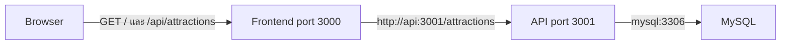

# คู่มืออ่าน Jenkins pipeline ของโปรเจกต์

ปัจจุบันแยก Jenkins เป็นสอง job และลบไฟล์ใน `scripts/` ทั้งหมดแล้ว คำสั่งหลักอยู่ใน Jenkinsfile ของแต่ละ job โดยตรง

## เริ่มอ่านจากไฟล์ไหน

| ไฟล์ | หน้าที่ |
| --- | --- |
| [Jenkinsfile](../Jenkinsfile) | Pipeline API และ MySQL |
| [Jenkinsfile.frontend](../Jenkinsfile.frontend) | Pipeline frontend |
| [คู่มือตั้งค่า Jenkins](jenkins-simple-th.md) | NodeJS plugin, Node22, environment file และการสร้างสอง job |
| [deploy.yml](../.github/workflows/deploy.yml) | GitHub Actions แบบ manual |
| [docker-compose.yml](../docker-compose.yml) | Services, network, ports, volume และ health checks |
| [API Dockerfile](../01_api/Dockerfile) | วิธีสร้าง API image |
| [Frontend Dockerfile](../02_frontend/Dockerfile) | วิธี build Next.js และสร้าง runtime image |

## ทำความเข้าใจ Jenkins steps

ตัวอย่าง Jenkins steps ใน API pipeline:

```groovy
stage('Unit Test') {
    steps {
        dir('01_api') {
            sh 'npm ci --include=dev'
        }
    }
}
```

อ่านตามลำดับว่า: สร้าง stage ชื่อติดตั้ง dependencies → Jenkins เข้าโฟลเดอร์ `01_api` → รันคำสั่งติดตั้ง package

`dir` คือ Jenkins step สำหรับเลือกโฟลเดอร์ ส่วน `sh` คือ Jenkins step ที่ใช้รันคำสั่งบน Linux คำสั่ง `npm ci` เป็นงานของ npm จึงยังต้องเรียกผ่าน `sh` ไม่ใช่ชื่อ Jenkins step โดยตรง

`environment` มีเพียง `BUILD_TAG` เหมือนต้นฉบับ ส่วนค่าฐานข้อมูลเขียนลง `.env` ด้วย `withCredentials` และ `writeFile`

Pipeline ใช้ `tools { nodejs 'Node22' }` ให้ Jenkins จัดการ Node/npm ไม่เขียน shell ตรวจ Node หรือสร้าง test container เอง

## Flow API

```text
Checkout
  deleteDir() → checkout scm
Prepare Environment
  withCredentials → writeFile .env
Validate
  docker compose config --quiet
Unit Test
  dir('01_api') → npm ci --include=dev → npm test
Build API
  docker compose build api
Deploy
  docker compose up mysql และรอ healthy แล้ว up api
Health Check
  curl /health และ /attractions
```

## Flow Frontend

```text
Checkout
  deleteDir() → checkout scm
Prepare Environment
  withCredentials → writeFile .env
Validate
  docker compose config --quiet
Unit Test
  dir('02_frontend') → npm ci --include=dev → npm test -- --runInBand
Build Frontend
  docker compose build frontend
Deploy
  docker compose up frontend โดยไม่ deploy API/MySQL
Health Check
  curl / และ /api/attractions
```

แต่ละ stage ต้องผ่านก่อนถึง stage ต่อไป เมื่อผิดพลาด Jenkins เข้าส่วน `post { failure { ... } }` เพื่อแสดง logs ไม่มี automatic rollback และไม่มีการลบ volume ฐานข้อมูล

## แอปคุยกันอย่างไร



Frontend ใช้ Next.js rewrite ส่ง `/api/attractions` ไป API ภายใน Docker network API query MySQL แล้วส่ง JSON กลับมา

Compose เก็บข้อมูลใน volume `mysql_data` ทั้งสอง job ใช้ project name จาก `name: docker-jenkins-pipeline` ใน Compose และสร้าง `.env` ของตัวเองจาก Jenkins credentials ชุดเดียวกัน ตรวจว่าตรงกับระบบเดิมก่อนเริ่มตามคู่มือตั้งค่า

API job ต้องผ่านก่อนรัน frontend ครั้งแรก เพราะ frontend health check ตรวจ proxy ไป API ด้วย HTTP checks ของ pipeline ใช้พอร์ต API 3001 และ frontend 3000 หากเปลี่ยน port ให้แก้ URL ตรวจสอบด้วย

## GitHub Actions

1. กด Run workflow บน branch `main`
2. Matrix แยกทดสอบ API และ frontend บน GitHub runner
3. Setup Node 22 → npm ci → npm test
4. เมื่อทั้งสองชุดผ่านจึง SSH เข้า VPS
5. รันเป็นเจ้าของ checkout แล้ว fetch/reset ไป commit ที่ทดสอบ
6. อ่าน environment file กลาง → build ทั้งสองบริการ → compose up และรอ healthy → curl ตรวจ endpoints

ไม่มีไฟล์ `.sh`, การเลือก build จาก Git diff หรือ marker ใน pipeline แล้ว สำหรับ GitHub คำสั่ง remote ยังเขียนใน `script:` ของ SSH action เพราะเป็นการสั่งงาน VPS ผ่าน SSH

Jenkins มี polling เหมือนต้นฉบับ หากทดสอบ GitHub ให้ Disable Jenkins jobs ชั่วคราว และเปรียบเทียบทีละระบบโดยใช้ commit เดียวกัน
