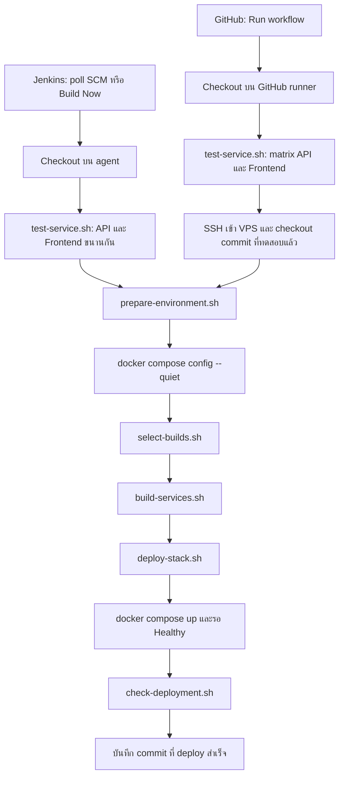
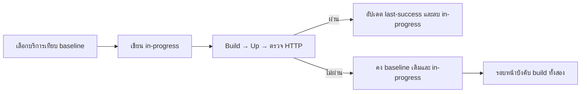
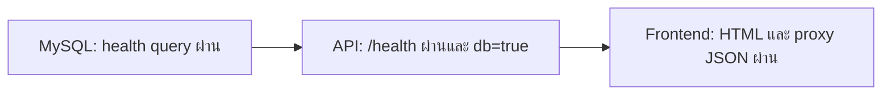
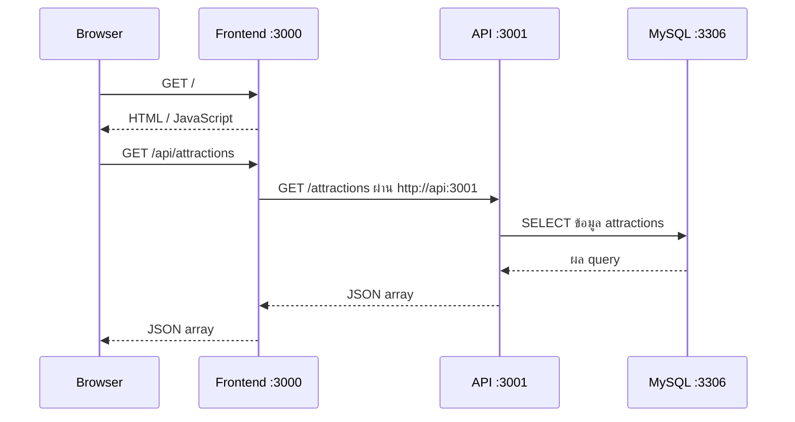

# คู่มือไปป์ไลน์ Jenkins และ GitHub Actions

> Jenkins ปัจจุบันแยกเป็น API และ Frontend แล้ว ดู [คู่มือ Jenkins แบบง่าย](jenkins-simple-th.md) ส่วนคำอธิบาย Jenkins ที่เรียก shared scripts ด้านล่างเป็นรูปแบบเดิมก่อนแยก ส่วน GitHub Actions ยังใช้ shared scripts อยู่

เอกสารนี้อธิบายโค้ดของโปรเจกต์ ณ วันที่ 6 ตุลาคม 2026 ทั้งสองระบบใช้สคริปต์ชุดเดียวกันสำหรับทดสอบ เตรียมค่าตั้งต้น เลือกบริการที่จะ build และ deploy ความต่างหลักคือ **Jenkins ทำงานบน agent ส่วน GitHub Actions ทดสอบบน GitHub runner แล้ว SSH ไป build และ deploy บน VPS**

## 1. ภาพรวมและคำศัพท์

- **CI**: ดึงโค้ดและทดสอบก่อนนำไปใช้งาน
- **CD / deploy**: สร้าง Docker image แล้วนำ container ของแอปขึ้นใช้งานและตรวจว่าตอบ HTTP ได้
- **Commit / SHA**: รุ่นของโค้ดที่กำลังทดสอบและ deploy
- **Image**: ชุดโปรแกรมที่ build ไว้ ส่วน **container** คือโปรแกรมที่รันจาก image
- **Workspace**: โฟลเดอร์ checkout ของ Git เช่น `/var/lib/jenkins/workspace/docker-jenkins-pipeline`
- **Volume**: ที่เก็บข้อมูลแยกจาก container ในโปรเจกต์นี้ใช้เก็บฐานข้อมูล MySQL

ไฟล์ควบคุมหลักคือ [Jenkinsfile](../Jenkinsfile) และ [deploy.yml](../.github/workflows/deploy.yml) ส่วน [docker-compose.yml](../docker-compose.yml) กำหนดบริการ `mysql`, `api` และ `frontend`



แต่ละขั้นต้องสำเร็จก่อนจึงไปขั้นถัดไป ถ้า unit test ไม่ผ่าน จะยังไม่ build หรือ deploy และ **ทั้งสองระบบทดสอบทั้ง API และ frontend เสมอ** แม้ภายหลังจะเลือก build เพียงบริการเดียว

## 2. Jenkins ทำงานอย่างไร

อ่านต้นฉบับ: [Jenkinsfile](../Jenkinsfile)

### จุดเริ่มต้น

`pollSCM('H/2 * * * *')` ให้ Jenkins ตรวจการเปลี่ยนแปลงของ repository ประมาณทุก 2 นาที เมื่อพบการเปลี่ยนแปลงจึงเริ่ม build หรือกด **Build with Parameters** เองได้ โดย `FORCE_BUILD_ALL=true` จะสั่ง build ทั้งสองบริการ

`agent any` หมายถึงใช้ Jenkins agent ที่พร้อมทำงาน ไม่ได้ระบุ IP VPS ไว้ในไฟล์นี้ การ build และ deploy ใช้ Docker daemon ที่ agent เข้าถึงอยู่ ดังนั้นหากต้องการ deploy บน VPS นี้ agent ต้องทำงานบน VPS หรือเชื่อมกับ Docker daemon ที่ตั้งใจใช้

`disableConcurrentBuilds()` ป้องกันงานของ Jenkins job เดียวกันรันพร้อมกัน ส่วน `skipDefaultCheckout(true)` ให้ checkout เกิดใน stage ที่เขียนไว้เอง

### ลำดับ stage

| Stage | สิ่งที่ทำ | เรียกอะไร |
| --- | --- | --- |
| Checkout | ดึงโค้ดจาก SCM และอ่าน commit แบบสั้นไว้แสดงใน log | `checkout scm`, `git rev-parse --short HEAD` |
| Unit Test | ทดสอบ API และ frontend แบบขนาน | `test-service.sh 01_api` และ `test-service.sh 02_frontend` |
| Prepare Environment & Detect Changes | อ่าน credentials สร้าง `.env` ตรวจ Compose แล้วเลือกบริการที่จะ build | `prepare-environment.sh`, `docker compose config --quiet`, `select-builds.sh` |
| Build Services | build เฉพาะบริการที่เลือก | `build-services.sh "$BUILD_API" "$BUILD_FRONTEND"` |
| Deploy & Health Check | เปิด container รอความพร้อมและตรวจ HTTP | `deploy-stack.sh` → `check-deployment.sh` |

Jenkins อ่าน credentials ชนิด **Secret text** ชื่อ `MYSQL_ROOT_PASSWORD` และ `MYSQL_PASSWORD` แล้วส่งเป็น environment variables `MYSQL_ROOT_PASS` และ `MYSQL_PASS` ให้สคริปต์เตรียม `.env`

เมื่อสำเร็จจะแสดงข้อความ commit และ URL เมื่อผิดพลาด ส่วน `post failure` จะพยายามแสดง log ล่าสุดของ frontend และ API เพิ่มเติม

## 3. GitHub Actions ทำงานอย่างไร

อ่านต้นฉบับ: [deploy.yml](../.github/workflows/deploy.yml)

### จุดเริ่มต้น

ปัจจุบันใช้ **`workflow_dispatch` เท่านั้น**: ไปที่ GitHub → Actions → **CI/CD Pipeline (GitHub Actions)** → **Run workflow** การ push เพียงอย่างเดียวไม่เรียก workflow นี้ เพื่อให้เลือกเปรียบเทียบกับ Jenkins ได้โดยไม่ deploy ซ้ำทุกครั้ง

ช่อง `force_build_all` มีความหมายเดียวกับ `FORCE_BUILD_ALL` ของ Jenkins สำหรับใช้งานตาม workflow ปัจจุบัน ให้เลือก branch `main` เพราะขั้น deploy fetch `origin main`

### Job 1: unit-tests

1. GitHub สร้าง runner `ubuntu-latest` สำหรับแต่ละค่าใน matrix: `01_api` และ `02_frontend`
2. `actions/checkout@v4` ดึงโค้ด
3. `actions/setup-node@v4` เตรียม Node.js 22
4. เรียก `sh scripts/test-service.sh "$SERVICE_DIR"`

สองบริการทดสอบแยกกันและทำงานขนานกัน `fail-fast: false` ทำให้อีกชุดยังทดสอบต่อได้เมื่อชุดหนึ่งล้มเหลว แต่ job deploy จะเริ่มได้ก็ต่อเมื่อทั้งสองชุดผ่าน

### Job 2: deploy

1. ตรวจว่าตั้ง `VPS_HOST_KEY_FINGERPRINT` แล้ว
2. `appleboy/ssh-action@v1.2.0` เชื่อม VPS พอร์ต 22 ด้วย SSH key และตรวจ fingerprint ของเครื่องปลายทาง กำหนดเวลาให้คำสั่ง remote สูงสุด 30 นาที
3. เข้า `APP_DIR` แล้วดูเจ้าของ `.git` ด้วย `stat`
4. หากบัญชี SSH เป็นเจ้าของ checkout อยู่แล้ว รันต่อด้วยบัญชีเดิม หากคนละบัญชี ใช้ `sudo -n -H -u เจ้าของcheckout` เพื่อให้ Git และไฟล์ที่สร้างใช้เจ้าของเดียวกัน เช่น SSH ด้วย `ubuntu` แต่ checkout เป็นของ `jenkins`
5. ตรวจรูปแบบ `DEPLOY_SHA` แล้ว `git fetch origin main`, ตรวจว่ามี commit และ `git reset --hard "$DEPLOY_SHA"`
6. เรียกสคริปต์เตรียม environment เลือก build สร้าง image และ deploy ตามลำดับเดียวกับ Jenkins

`DEPLOY_SHA` มาจาก `github.sha` จึง deploy commit ที่ workflow ทดสอบ ไม่ได้เลือก commit ล่าสุดใหม่ตามใจเมื่อ SSH เข้าไปถึง VPS

**การ build image เกิดบน VPS** ไม่ได้ build บน GitHub แล้วส่ง image มา ส่วน unit test เกิดบน GitHub runner

> `git reset --hard` ทับการแก้ไข tracked files ใน workspace ดังนั้นควรแก้โค้ดในเครื่องทำงานแล้ว commit/push ไม่แก้ไฟล์ค้างไว้บน deployment workspace

### Secrets ที่ GitHub ต้องใช้

| Secret | ใส่อะไร / ใช้เพื่ออะไร |
| --- | --- |
| `VPS_HOST` | IP หรือ hostname ของ VPS |
| `VPS_USER` | บัญชีที่ SSH เข้า VPS เช่น `ubuntu` |
| `VPS_SSH_KEY` | Private key ที่ใช้ SSH เข้าบัญชีข้างบน โดย public key คู่กันต้องได้รับอนุญาตบน VPS |
| `VPS_HOST_KEY_FINGERPRINT` | Fingerprint ของ SSH host key ของ VPS ที่ตรวจสอบจากเครื่องที่เชื่อถือได้ ใช้ยืนยันปลายทาง ไม่ใช่ fingerprint ของ login key |
| `MYSQL_ROOT_PASSWORD` | รหัส root ของ MySQL ที่ใช้กับฐานข้อมูลนี้ |
| `MYSQL_PASSWORD` | รหัสผู้ใช้แอปของ MySQL |
| `VPS_APP_DIR` | โฟลเดอร์ checkout บน VPS หากไม่ตั้ง ใช้ `/var/lib/jenkins/workspace/docker-jenkins-pipeline` |

Workflow ไม่ได้ clone โปรเจกต์ใหม่หรือเตรียมสิทธิ์ sudo ให้เอง ต้องมี checkout อยู่แล้ว เจ้าของ checkout ต้องใช้ Docker และ fetch Git remote ได้ หากใช้คนละบัญชีกับ SSH ต้องได้รับสิทธิ์ sudo แบบไม่ถามรหัส เพราะ `sudo -n` จะหยุดทันทีหากต้องถามรหัส

## 4. สคริปต์แต่ละไฟล์ทำอะไร

คำสั่งตัวอย่างในส่วนนี้ให้รันจาก root ของ repository บน Linux/VPS การเรียกสคริปต์ build/deploy จะเปลี่ยนระบบที่กำลังใช้งานจริง

### 4.1 `test-service.sh` — ทดสอบโค้ดในพื้นที่ชั่วคราว

ต้นฉบับ: [scripts/test-service.sh](../scripts/test-service.sh)

**ผู้เรียก:** stage Unit Test ของ Jenkins และ matrix unit-tests ของ GitHub Actions

**Input:** argument ต้องเป็น `01_api` หรือ `02_frontend` เช่น:

```sh
sh scripts/test-service.sh 01_api
sh scripts/test-service.sh 02_frontend
```

ขั้นตอนภายใน:

1. สร้างโฟลเดอร์ชั่วคราว `pipeline-test.XXXXXX`
2. ใช้ `git archive HEAD` สร้าง archive ของ tracked files ทั้ง repository ต้องสร้างสำเร็จก่อนเริ่มทดสอบ
3. หากเครื่องมี `node` และ `npm` และ Node major version เป็น **22** จะ extract แล้วทดสอบบนเครื่องนั้น
4. หากไม่เข้าเงื่อนไข จะใช้ container `node:22-alpine` รับ archive ผ่าน stdin และ extract ภายใน container ใช้ UID/GID ของผู้เรียก
5. เข้าโฟลเดอร์บริการ แล้วรัน `npm ci --include=dev` ตามด้วย `npm test`
6. ลบพื้นที่ชั่วคราวเมื่อสคริปต์จบ และ Docker test container ใช้ `--rm`

สคริปต์ไม่ใช้ `node_modules` เดิมของ workspace จึงแก้ปัญหา Jenkins ลบ `/app/node_modules/.bin` ไม่ได้เพราะไฟล์เก่าเป็นของบัญชีอื่น และไม่ติดตั้ง dependency ลง workspace ร่วมกันระหว่างสองชุดทดสอบ

Snapshot นี้เป็นโค้ดที่ commit ไว้ใน `HEAD` ไม่รวมไฟล์ untracked หรือการแก้ไขที่ยังไม่ commit การ archive ทั้ง repository ยังรองรับ dependency ของ frontend ที่อ้าง root package ด้วย `file:..`

API ใช้ Node test runner และ mock การ query ฐานข้อมูล ส่วน frontend ใช้ Jest และ mock fetch จึง **ไม่ต้องเปิด MySQL จริงสำหรับ unit tests** หากติดตั้ง package หรือ test ล้มเหลว สคริปต์คืน exit code ที่ทำให้ pipeline หยุด

### 4.2 `prepare-environment.sh` — สร้าง `.env` สำหรับ Compose

ต้นฉบับ: [scripts/prepare-environment.sh](../scripts/prepare-environment.sh)

**ผู้เรียก:** Jenkins stage เตรียม environment และคำสั่ง remote ของ GitHub ก่อนเลือก build

**Input:** environment variables `MYSQL_ROOT_PASS` และ `MYSQL_PASS` ต้องมีค่า

สคริปต์รัน Node 22 ใน Docker โดย mount root workspace แล้วเขียน `.env` ด้วยสิทธิ์ `0600` คืออ่านและเขียนได้เฉพาะเจ้าของไฟล์ พร้อมจัดการอักขระพิเศษในค่าและปฏิเสธค่าแบบหลายบรรทัด โดยไม่พิมพ์รหัสผ่านลง log

| ค่าที่เขียนใน `.env` | ที่มา / ค่า |
| --- | --- |
| `MYSQL_ROOT_PASSWORD` | `MYSQL_ROOT_PASS` |
| `MYSQL_PASSWORD` | `MYSQL_PASS` |
| `MYSQL_DATABASE` | `attractions_db` |
| `MYSQL_USER` | `attractions_user` |
| `MYSQL_PORT`, `DB_PORT` | `3306` |
| `API_PORT` | `3001` |
| `FRONTEND_PORT` | `3000` |
| `NODE_ENV` | `production` |
| `API_HOST_INTERNAL` | `http://api:3001` |

จากนั้น pipeline เรียก `docker compose config --quiet` เพื่อตรวจว่าการตั้งค่า Compose อ่านและประกอบได้ หากมีปัญหาจะยังไม่เริ่ม build

สคริปต์นี้เขียนค่าใหม่ใน `.env` ไม่ได้เปลี่ยนรหัสผ่านในฐานข้อมูล MySQL ที่มีข้อมูลอยู่แล้ว ดังนั้น Jenkins credentials และ GitHub secrets ต้องใช้รหัสเดียวกับฐานข้อมูลเดิม

### 4.3 `select-builds.sh` — ตัดสินใจว่าจะ build บริการไหน

ต้นฉบับ: [scripts/select-builds.sh](../scripts/select-builds.sh)

**ผู้เรียก:** Jenkins หลังเตรียม environment และ GitHub remote script ในจุดเดียวกัน

**Input:** `true` หรือ `false` หมายถึงบังคับ build ทั้งหมดหรือไม่ ค่าเริ่มต้น `false`

```sh
sh scripts/select-builds.sh false
# ตัวอย่าง stdout:
# BUILD_API=true
# BUILD_FRONTEND=false
```

Jenkins อ่านสองบรรทัดนี้เป็น environment variables ส่วน GitHub remote script ใช้ `sed` อ่านค่าแล้วส่งให้ `build-services.sh`

สคริปต์เทียบไฟล์ที่เปลี่ยนระหว่าง **commit ที่ deploy สำเร็จล่าสุด** กับ `HEAD` ไม่ได้เทียบเฉพาะ commit ก่อนหน้าหรือผล unit test ล่าสุด

| เงื่อนไข | ผลการเลือก |
| --- | --- |
| บังคับ build (`true`) | ทั้ง API และ frontend |
| ไม่มี image ของบริการ | เลือกบริการที่ไม่มี image เพิ่ม |
| มี marker ของ deploy ที่ยังไม่สำเร็จ | ทั้งสองบริการ |
| ไม่มี baseline หรือ commit ใน baseline ใช้ไม่ได้ | ทั้งสองบริการ |
| รันซ้ำ commit เดิม ไม่มีไฟล์เปลี่ยน | ทั้งสองบริการ เพื่อให้เกิด build จริง |
| เปลี่ยนไฟล์ใน `01_api/` | API |
| เปลี่ยนไฟล์ใน `02_frontend/` | Frontend |
| เปลี่ยน Compose, Jenkinsfile, root `package.json`, `.gitattributes`, root `.env*`, `scripts/` หรือ `.github/workflows/` | ทั้งสองบริการ |
| เปลี่ยนเฉพาะเอกสาร และ baseline/images ปกติ ไม่มีเงื่อนไขบังคับ | ไม่ build ทั้งสองบริการ แต่ยังเดินขั้น deploy/check ต่อ |

เงื่อนไขเลือกบริการสะสมกัน เช่นเปลี่ยน API แต่ frontend image หาย ก็เลือกทั้งสอง สคริปต์นี้เพียงแสดงผลการเลือก ยังไม่สร้าง image หรือ container

### 4.4 `build-services.sh` — สร้าง Docker image ที่เลือก

ต้นฉบับ: [scripts/build-services.sh](../scripts/build-services.sh)

**ผู้เรียก:** stage Build Services ของ Jenkins และ GitHub remote script

**Input:** boolean สองค่า ตามลำดับ **API, frontend**:

```sh
sh scripts/build-services.sh true false   # API เท่านั้น
sh scripts/build-services.sh false true   # Frontend เท่านั้น
sh scripts/build-services.sh true true    # ทั้งสอง
```

1. ตรวจว่าค่าทั้งสองเป็น `true` หรือ `false`
2. เขียน commit ปัจจุบันลง marker `ci-deploy-in-progress` ก่อนเริ่ม build แม้เลือกทั้งสองเป็น `false`
3. บริการที่เลือกจะใช้ `docker compose build --pull --no-cache api` หรือ `frontend`
4. ถ้าเลือกทั้งสอง จะเริ่ม build ขนานกัน แล้วรอผลทั้งสองงาน
5. หากงานใดล้มเหลว คืน exit code ผิดพลาดและยังไม่เรียก deploy

`--pull` ให้พยายามดึง base image ใหม่ ส่วน `--no-cache` ไม่ใช้ Docker build layer cache บริการที่ไม่ได้เลือกยังใช้ image เดิม ไม่ได้ลบข้อมูล MySQL

Marker ที่ค้างหลัง failure/cancel ทำให้รอบหน้าสร้างทั้งสองบริการใหม่ เพราะ build ที่ล้มเหลวบางส่วนอาจเปลี่ยน image tag ของอีกบริการไปแล้ว

### 4.5 `deploy-stack.sh` — เปิดระบบและบันทึกผลสำเร็จ

ต้นฉบับ: [scripts/deploy-stack.sh](../scripts/deploy-stack.sh)

**ผู้เรียก:** stage Deploy & Health Check ของ Jenkins และ GitHub remote script หลัง build ผ่าน

ลำดับคำสั่ง:

```sh
docker compose up -d --remove-orphans --wait --wait-timeout 180
sh scripts/check-deployment.sh
# แสดง log ล่าสุด แล้วบันทึก HEAD เป็น baseline และลบ unfinished marker
```

- `-d`: เปิด container แบบ background
- `--remove-orphans`: ลบ container ที่เคยอยู่ใน Compose project นี้แต่ไม่อยู่ใน service definitions ปัจจุบัน
- `--wait`: รอให้บริการพร้อมตาม health checks
- `--wait-timeout 180`: กำหนดเวลารอสูงสุด 180 วินาที

เมื่อเปิดระบบและตรวจคำตอบผ่าน จะแสดง log ล่าสุด บันทึก commit ไปที่ `ci-last-success` และลบ `ci-deploy-in-progress`

หากเกิดข้อผิดพลาด สคริปต์พยายามแสดง log ของ API/frontend และไม่เลื่อน baseline **ไม่มี automatic rollback ในสคริปต์นี้** หากล้มเหลวระหว่าง deploy บาง container อาจถูกอัปเดตไปแล้ว

ไม่เรียก `docker compose down -v` และไม่ลบ volume ฐานข้อมูล

### 4.6 `check-deployment.sh` — ตรวจว่าระบบตอบจริง

ต้นฉบับ: [scripts/check-deployment.sh](../scripts/check-deployment.sh)

**ผู้เรียก:** `deploy-stack.sh` หรือเรียกเองเพื่อตรวจระบบที่เปิดอยู่:

```sh
sh scripts/check-deployment.sh
```

สคริปต์อ่าน host ports จริงจาก `docker compose port` แล้วใช้ `curl` ตรวจ 4 URL บนเครื่อง deploy จำนวน **3 รอบ**:

| URL ที่ตรวจ | ตรวจอะไร |
| --- | --- |
| `127.0.0.1:<API port>/health` | API เชื่อมฐานข้อมูลและตอบ health ได้ |
| `127.0.0.1:<API port>/attractions` | API endpoint หลักตอบได้ |
| `127.0.0.1:<frontend port>/` | หน้าบ้านส่ง HTML ได้ |
| `127.0.0.1:<frontend port>/api/attractions` | ทาง proxy จาก frontend ไป API ตอบได้ |

แต่ละคำขอมี connect timeout 3 วินาทีและเวลารวมไม่เกิน 5 วินาที HTTP error หรือ timeout ทำให้ตรวจไม่ผ่าน พร้อมแสดง log

Log แสดง `status`, `first_byte` (เวลารอข้อมูลแรก) และ `total` (เวลารวมของคำขอ) จึงช่วยดูกรณีหน้าเว็บหมุนรอโดย server ยังไม่ส่งข้อมูล

หลังตรวจด้วย curl จะรัน Node ภายใน frontend container เพื่อเรียก `/api/attractions` อีกครั้ง และยืนยันว่าคำตอบเป็น JSON array ไม่ใช่หน้า HTML ที่บังเอิญตอบ HTTP 200

การตรวจนี้ทำจากเครื่อง deploy และภายใน container **ยังไม่ได้ยืนยันเส้นทางจากเบราว์เซอร์ผ่านอินเทอร์เน็ต** หากผ่านแล้วแต่เปิด IP/domain ยังช้า ต้องตรวจเส้นทางภายนอกหรือคำขออื่นใน browser เพิ่ม

### 4.7 `collect-vps-evidence.sh` — สคริปต์เก็บข้อมูลวิเคราะห์ VPS

ต้นฉบับ: [scripts/collect-vps-evidence.sh](../scripts/collect-vps-evidence.sh)

**ผู้เรียก:** ผู้ดูแลรันเอง ไม่มี Jenkins, GitHub หรือ deploy script ตัวใดเรียกไฟล์นี้

```sh
sudo bash scripts/collect-vps-evidence.sh
```

ต้องใช้ root เพื่ออ่านข้อมูลระบบ เก็บรายการ process, network connections, login/auth logs, accounts, SSH key fingerprints, systemd, cron และข้อมูล Docker พร้อมสถานะ exit ของแต่ละคำสั่ง มี timeout ของคำสั่งเก็บข้อมูลเพื่อไม่ให้หยุดค้างง่าย

สร้าง report ใน `/var/tmp/vps-evidence.<สุ่ม>/report` พร้อม `evidence.tar.gz` และ checksum `.sha256` แล้วแสดง path จริงให้ผู้รันเห็น เป็นเครื่องมือวิเคราะห์ ไม่ได้แก้แอป หยุด Jenkins หรือ deploy ระบบ

## 5. ไฟล์สถานะ: รอบถัดไปรู้ได้อย่างไรว่ารอบก่อนสำเร็จ

สคริปต์ใช้ `git rev-parse --git-path ...` เพื่อหาที่เก็บ marker โดย checkout ทั่วไปจะอยู่ใน `.git/`:

| ไฟล์ | ผู้เขียน / ลบ | ความหมาย |
| --- | --- | --- |
| `ci-deploy-in-progress` | `build-services.sh` เขียน; `deploy-stack.sh` ลบเมื่อสำเร็จ | มีความพยายาม build/deploy ที่ยังไม่จบสำเร็จ |
| `ci-last-success` | `deploy-stack.sh` เขียนหลังตรวจผ่าน | Commit ล่าสุดที่ deploy และตรวจผ่าน |



หาก Jenkins และ GitHub ใช้ **checkout เดียวกัน** จะเห็น marker ชุดเดียวกัน หากใช้คนละ clone จะมี baseline คนละชุด แม้ deploy ไป VPS เดียวกัน

## 6. หลัง build แล้วแอปทำงานอย่างไร

### Dockerfiles

- [01_api/Dockerfile](../01_api/Dockerfile): ใช้ Node 22 Alpine ติดตั้ง production dependencies ด้วย `npm ci --omit=dev` แล้วรัน `node index.js` ด้วยผู้ใช้ `node`
- [02_frontend/Dockerfile](../02_frontend/Dockerfile): ใช้ Node 22 Alpine build Next.js จากนั้นคัดลอก standalone output, static files และ public files ไป runtime image รัน `node server.js` ด้วยผู้ใช้ `nextjs`
- [02_frontend/next.config.mjs](../02_frontend/next.config.mjs): กำหนด standalone output และ rewrite เพื่อส่ง `/api/...` ไป API ภายใน Docker network

Test container เป็นคนละตัวกับ production container แม้จะใช้ Node major version 22 เหมือนกัน

### Compose เปิดบริการตามลำดับ



API รอ MySQL healthy และ frontend รอ API healthy ตัวแอปใช้ read-only filesystem พร้อมพื้นที่ชั่วคราวที่จำเป็นและลดสิทธิ์ container ตาม Compose

| บริการ | พอร์ตค่าเริ่มต้นบน VPS | หน้าที่ |
| --- | --- | --- |
| frontend | `3000` | หน้าเว็บ Next.js และ proxy ไป API |
| api | `3001` | API และ health endpoint |
| mysql | `127.0.0.1:3306` | ฐานข้อมูล เปิด host port เฉพาะ loopback |

### เส้นทางเมื่อเปิดหน้าบ้าน



`api` และ `mysql` เป็นชื่อบริการที่ container ใช้คุยกันใน Docker network ส่วน `localhost` ภายในแต่ละ container หมายถึง container นั้นเอง เบราว์เซอร์เรียก `/api/attractions` ผ่าน frontend ไม่ต้องรู้ชื่อ `api` ภายใน Docker

ข้อมูล MySQL อยู่ใน named volume `mysql_data` การสร้าง app containers ใหม่ยังใช้ข้อมูลเดิมเมื่อใช้ Compose project เดิม หากเปลี่ยนชื่อ project อาจไปใช้ volume อีกชุดได้ จึงควรใช้ project/workspace เดิมในการเปรียบเทียบ

## 7. ใช้อย่างไรเพื่อเปรียบเทียบสองแบบ

### ใช้ Jenkins

1. ตั้ง job ให้ใช้ `Jenkinsfile` ของ repository และ branch ที่ต้องการ เช่น `main`
2. เตรียม credentials `MYSQL_ROOT_PASSWORD` และ `MYSQL_PASSWORD`
3. Agent ต้องมี Git, Docker พร้อม Compose และเครื่องมือที่สคริปต์ใช้ เช่น curl/tar และใช้ Docker ได้ Node บน agent ไม่จำเป็นต้องเป็น 22 เพราะมี Docker fallback สำหรับ test
4. กด Build with Parameters หรือ push แล้วรอ polling ตรวจพบ
5. ดูผลแต่ละ stage และข้อความ health check

### ใช้ GitHub Actions

1. ตั้ง secrets ตามตารางในส่วน 3 และเตรียม checkout บน VPS
2. เจ้าของ checkout ต้องมีสิทธิ์ Docker และเข้าถึง Git remote ได้ พร้อมเครื่องมือสำหรับ deploy หาก SSH คนละบัญชีต้องมีสิทธิ์ sudo ที่ workflow ใช้
3. ไป Actions → Run workflow → เลือก `main` และเลือก force build ตามต้องการ
4. ดู unit-tests ทั้งสองชุดก่อน แล้วดู job deploy และ remote logs

### เปรียบเทียบให้ตรงกัน

ใช้ commit เดียวกัน ฐานข้อมูลและ Compose project เดียวกัน และเลือก force build ทั้งสองระบบหากต้องการเปรียบเทียบเวลาสร้างทั้ง API/frontend ให้ครบ

**รันทีละระบบ** เพราะ Jenkins `disableConcurrentBuilds()` ล็อกเฉพาะ Jenkins job และ GitHub `concurrency: production-deploy` ล็อกเฉพาะฝั่ง GitHub ไม่มี lock กลางระหว่างสองระบบ หากจะทดสอบ GitHub อย่างเดียว ให้พัก trigger ของ Jenkins job ชั่วคราว

เวลาทั้ง pipeline ไม่จำเป็นต้องเท่ากัน: Jenkins ทดสอบบน agent ส่วน GitHub ต้องจัด runner ทดสอบและเชื่อม SSH ขณะที่งาน build/deploy ใช้สคริปต์เดียวกันบนเครื่องปลายทาง

## 8. อ่าน error ที่เคยพบ

| Error / อาการ | เกิดที่ไหนและควรตรวจอะไร |
| --- | --- |
| `ssh: host key fingerprint mismatch` | ก่อนเข้า VPS: fingerprint secret ไม่ตรงกับ host key ที่ SSH action ได้รับ ตรวจ key ของปลายทางที่เชื่อถือได้แล้วตั้ง secret ให้ถูก |
| `fatal: detected dubious ownership` | Git ถูกเรียกด้วยบัญชีที่ไม่ใช่เจ้าของ checkout โค้ดปัจจุบันแก้ด้วยการรันเป็นเจ้าของ `.git`; ตรวจ ownership และสิทธิ์ sudo หากยังเกิด |
| `EACCES ... node_modules/.bin` | dependency tree เก่าเป็นของอีกบัญชี โค้ดปัจจุบันใช้ test snapshot ชั่วคราว หากยังเห็น path แบบเก่า ตรวจว่า Jenkins checkout commit ที่มีสคริปต์ใหม่แล้ว |
| Unit test แสดงข้อความ error แต่สรุปผ่าน | บางกรณีเป็น test ที่ตั้งใจ mock failure ให้ดูจำนวน tests ที่ผ่านและ exit code ไม่ใช่ข้อความ error อย่างเดียว |
| MySQL/API unhealthy | ตรวจ `docker compose logs --tail=80 mysql api` และค่ารหัสผ่านของฐานข้อมูลเดิม |
| Frontend `HTTP 000` / timeout | คำขอไม่สำเร็จภายในเวลาที่กำหนด ดู frontend/API logs และเทียบผล `/` กับ `/api/attractions` |
| SSH ขอรหัส sudo / `sudo` ล้มเหลว | Workflow ใช้ `sudo -n` จึงไม่รับรหัสผ่านแบบ interactive ต้องมีสิทธิ์รันเป็นเจ้าของ checkout ตามที่กำหนด |

คำสั่งตรวจระบบหลัง deploy:

```sh
docker compose ps
docker compose logs --tail=80 frontend api
sh scripts/check-deployment.sh
docker stats --no-stream
```

## 9. แผนที่ไฟล์สำหรับอ่านต่อ

| ไฟล์ | บทบาท |
| --- | --- |
| [Jenkinsfile](../Jenkinsfile) | จุดเริ่มต้นและลำดับ stage ของ Jenkins |
| [deploy.yml](../.github/workflows/deploy.yml) | จุดเริ่มต้น jobs, secrets และ SSH ของ GitHub Actions |
| [test-service.sh](../scripts/test-service.sh) | ทดสอบ tracked HEAD ใน snapshot ชั่วคราว |
| [prepare-environment.sh](../scripts/prepare-environment.sh) | เขียน `.env` สำหรับ Compose |
| [select-builds.sh](../scripts/select-builds.sh) | เลือกบริการจาก baseline และไฟล์ที่เปลี่ยน |
| [build-services.sh](../scripts/build-services.sh) | สร้าง image ที่เลือกและเขียน unfinished marker |
| [deploy-stack.sh](../scripts/deploy-stack.sh) | Up, รอ readiness, เรียกตรวจ และบันทึก baseline |
| [check-deployment.sh](../scripts/check-deployment.sh) | ตรวจ HTTP และ proxy JSON จริง |
| [collect-vps-evidence.sh](../scripts/collect-vps-evidence.sh) | เครื่องมือเก็บข้อมูล VPS ที่รันเองนอก pipeline |
| [docker-compose.yml](../docker-compose.yml) | บริการ network, ports, volume และ health checks |
| [คู่มือเปรียบเทียบภาษาอังกฤษ](pipeline-comparison.md) | รายละเอียดเปรียบเทียบและการตั้งค่าเพิ่มเติม |
